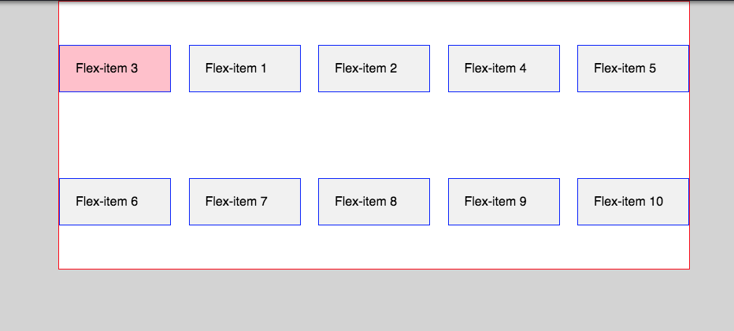

#Guide to Learn CSS FlexBox

Flexbox is a CSS3 one dimensional layout model making it much easier to make page layouts when building web pages. Gone are the days of using floats and them horrible clear fixes to position out sections of a page. Flexbox is a great way for creating layouts for websites. The first thing you need to do is create a flex container. This is as simple as typing `display: flex;` on any parent container div. Straight away you should see a change to your layout, all children elements inside that container div should now all be horizontally aligned. See example below.

The parent element with child elements - by default the children elements are all block elements below each other on the page, but once you apply `display:flex;` to the parent container they will all sit side by side of each other.

```
<div class="container">
	<section>1</section>
	<main>2</main>
	<section>3</section>
</div>

.container { display:flex; }
```


Next let's look at some of the cool features of flexbox. `flex-direction` is first style we are going to look at, this changes the direction of the flex-items inside the container, options you can use is, `row, row-reverse, column, column-reverse`. Row is the default, have a play, you use it on the parent container like, `flex-direction: column;`

Let's now look at `justify-content.` This is used to define the alignment of the content along the main axis and use up free space. (if you are using flex-direction: column; then it will be along the cross axis and you would have to set the parent container to have a height) The default for this style is `justify-content: flex-start;`
The other options you can use are:  `flex-end, center, space-round, space-between and space-evenly`

In your CSS add `.container` class and put `justify-content: space-between;` also add some width to your main and section of `100px`. So your styles will look like this

```
.container {
display:flex;
background-color: white;
border:1px solid red;
max-width: 800px;
margin: 0 auto;
justify-content: space-between;
}
main,
section { 	
background-color: #f1f1f1;
padding: 20px;
width: 100px;
}
```


Have a play around with the other options to see the difference here's some examples using space-around and center.


The next style is `align-items`. `align-items` allows you to layout your flex-items along the cross axis again this is the opposite if you are using flex-direction: column on the parent. Let's add some height to our `.container` add `height: 50vh;` (which will be 50 viewpoint height of your screen) then also add `align-items: center;` the default for this is `stretch`. The other options are, `flex-start, flex-end, center, baseline`

Below is an image of the flex-items that are vertically and horizontally centered. See the CSS below.


```
.container {
	border:1px solid red;
	height: 50vh;
margin: 0 auto;
	background-color: white;
	max-width: 800px;
	display:flex;
	align-items:center;
	justify-content:space-between;
}
```

Let's look at flex-wrap now, say you have around 8 flex-items or more, they will all stay on the same row and all fit in till there is no more room and it will just end up going off the screen, if we set flex-wrap: wrap on the parent container the items that don’t fit will go down onto the next row.



Last one for the parent container is `align-content` which can be used to align the rows of flex-items, this has the same options as `justify-content`. So we could center the rows of flex-items.

Now for the flex-items the children of the parent container. You can order the flex-items with order. We need to give class to the flex-item we want to order, lets order the 3rd flex-item. Give it a class of third then in your CSS add `order: -1`. I’ve also give a `background-color` so this flex-item stands out. As you can see adding -1 sends the 3rd item to the beginning. You can do this to any of the items give them a class name and then an order number. The default is 0.

`.third {order:-1; background-color: pink}`


Other styles are `flex-grow` and `flex-shrink`, you can use these to grow and shrink elements, the default number for `flex-grow` is 0 and `flex-shrink` is 1. If we want to set the third item again to have a `flex-grow: 2`. This will give it twice as much space as the other items. There is also `flex-basis` which is used to define a default size before the remaining space gets distributed, you can use `px`, `%`, `em`, or `rem`. The default is `auto`. We can combine these 3 styles by using just `flex`. The first and second are `flex-grow` and `flex-shrink` then `flex-basis`.

`flex: 0 1 auto;`

And the last one im going to talk about is `align-self`, if you want to align a single flex-item so it’s not the same as the rest. Let set the third item to `align-self: flex-start`.

```
.third {
	background-color: pink;
	order:-1;
	flex-grow: 2;
	align-self: flex-start;
	border:0;
}
```

